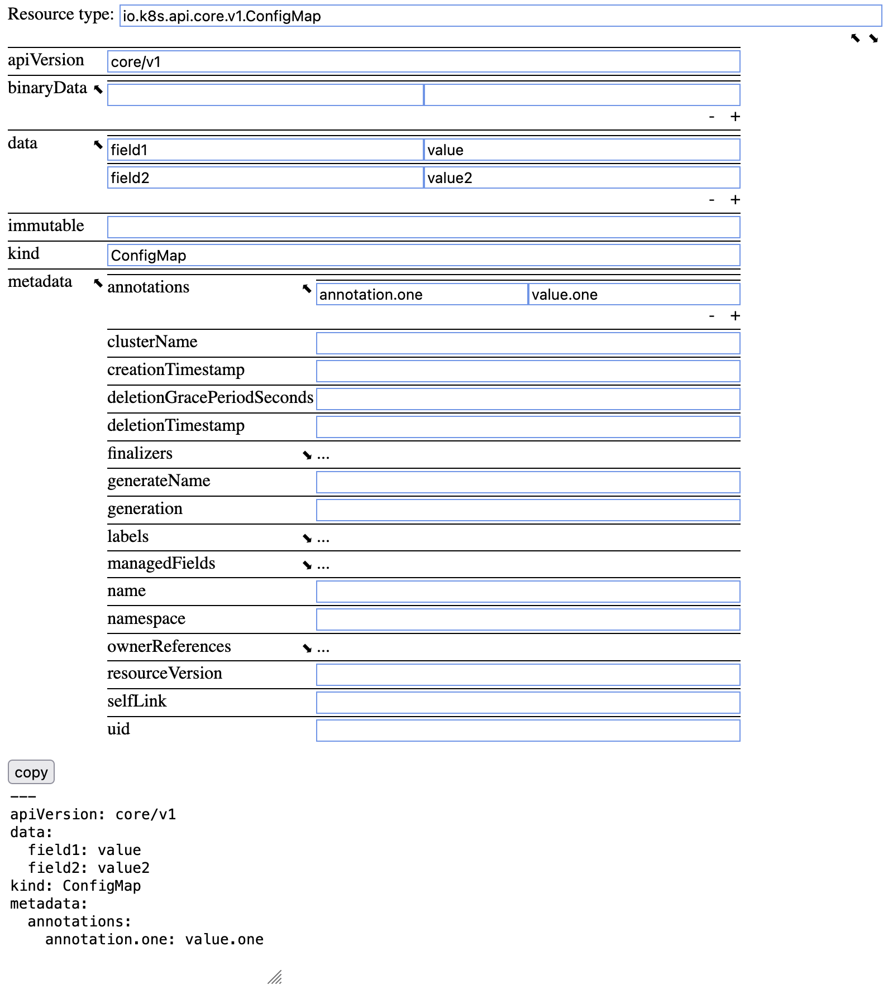

# Kubernetes GVK editor

This project provides a UI for constructing Kubernetes GVK resources.
constructing k8s GVK resources. It parses the kubernetes openapi spec from
[https://github.com/kubernetes/kubernetes/blob/master/api/openapi-spec/swagger.json][1]
and generates a form for the user to fill out. As the user fills in the form a
yaml representation of the resource is generated at the bottom which can be
copied.

## Limitations
Free-form objects, like CustomResourceDefinitions, are not supported

## Live
A live version of this project can be found at
[https://mrxk.github.io/k8s-gvk-editor/main.html][2]

## Install
1. Clone this project
1. Load the `$PROJECT_ROOT/main.html` file in a browser.
   
## Build
1. Run `dev-env connect` in `$PROJECT_ROOT` (https://github.com/mrxk/dev-env)
1. In the container, run `make`

As an alternative to using `dev-env`, docker build
`$PROJECT_ROOT/.dev-env/main/Dockerfile` and use that container for the `make`
command.

## Screenshot

[1]: https://github.com/kubernetes/kubernetes/blob/master/api/openapi-spec/swagger.json
[2]: https://mrxk.github.io/k8s-gvk-editor/main.htm
